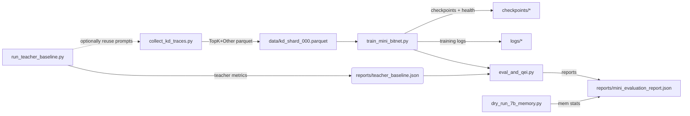

# BitNet-7B-KDE — Technical Design & CI Integration

This document explains the architecture, how each script/module talks to the others, and how the CI pipeline ties everything together.

---

## 1) High-level architecture

```
                 +-----------------------+
                 |  .env / .env.ci      |
                 |  (dotenv)            |
                 +----------+-----------+
                            |
                            v
+---------------------------+-----------------------------------------------+
|                         src/bitnet                                        |
|                                                                           |
|  +--------------------+     +------------------+     +-----------------+  |
|  | storage & config   |     |  LLM clients     |     |  data loading   |  |
|  | (scripts/storage)  |     | (llm_clients)    |     | (data.py)       |  |
|  +--------------------+     +------------------+     +-----------------+  |
|             |                         |                         |         |
|             v                         v                         v         |
|       paths & caches           provider selection          KDTraceDataset |
|                                   (OpenAI, etc.)          collate_fn     |
|                                                                           |
|          +-------------------+       +-----------------+       +--------+ |
|          |  models.py        |<----->|  losses.py      |<----->| train | |
|          |  BitNet (mini/7B) |       |  KD/CE/format   |       | loop  | |
|          +-------------------+       +-----------------+       +--------+ |
+---------------------------------------------------------------------------+

Top-level *scripts/* orchestrate the flow; *Makefile* provides entry points; *CI* calls a safe subset.
```

---

## 2) Components & responsibilities

### `scripts/storage.py`

* Loads **all** runtime paths from `.env` (`DRIVE_ROOT`, subfolders, caches).
* (Optionally) mounts Google Drive in Colab.
* Creates directories; exports cache envs so `transformers`, `datasets`, `torch` use Drive-backed caches.
* Returns a dict of resolved paths to callers.

### `src/bitnet/llm_clients.py`

* Unifies access to hosted LLM providers.
* Selects provider via `PROVIDER`/`TEACHER_PROVIDER` (`openai|anthropic|groq|aimlapi|gemini`).
* Builds requests with model, temperature, `logprobs`/`top_logprobs` when supported.
* Returns normalized results (text, tokens, top-k, logprobs).
* Reads API keys/base URLs from `.env`.

### `src/bitnet/data.py`

* `KDTraceDataset`: loads KD traces from Parquet (`pyarrow`).
* Groups rows by `prompt_idx`, sorts by `step_idx`.
* Truncation (`max_seq_len`) and top-k clipping (`max_topk`).
* Returns tensors for: `input_ids`, `teacher_sample_id`, `topk_ids`, `topk_logprobs`, `other_logprob`, `is_struct_token`.
* `collate_fn`: pads time dimension, builds `attention_mask`, keeps K fixed.

### `src/bitnet/models.py`

* BitNet mini transformer:

  * `BitLinear` with **ternary weights (STE)** and learned per-channel scales.
  * `FakeQuantActivation` with STE (A8→A4 flip).
  * `RMSNorm`, attention, MLP (SwiGLU), pre-norm blocks.
  * Global method `set_activation_bits(bits)`.
  * Causal + key padding masks inside `forward`.
* 7B **dry-run** uses the same class with larger config for forward-only tests.

### `src/bitnet/losses.py`

* `kd_cross_entropy_loss`: next-token aligned KD:

  * Student/teacher both at temperature τ.
  * Teacher distribution = **Top-K + “other”** mass.
  * Safe padding: invalid steps -> `P(other)=1`.
* `format_loss`: boosts structural tokens (JSON-ish).
* `combined_loss`: `KD + (CE * weight) + (format * weight)`.
* Returns scalar loss + metrics dict.

---

## 3) Orchestration scripts

All scripts call `prepare_storage()` first so paths/caches are deterministic.

* `scripts/run_teacher_baseline.py`

  * Runs **deterministic/greedy** baseline against the teacher.
  * Saves `teacher_baseline.json` (decode TPS, tokens, config, prompt hash).

* `scripts/collect_kd_traces.py`

  * Samples with training temperature/top-p.
  * Extracts `top_k` token strings + logprobs from teacher response.
  * Projects to student tokenizer (**first-subtoken rule + log-sum-exp dedup**).
  * Computes **“other”** log-mass.
  * Saves a shard `data/kd_shard_000.parquet`.

* `scripts/train_mini_bitnet.py`

  * Sets up `DataLoader` from Parquet, builds model & optimizer (AdamW + cosine).
  * Mixed precision: `autocast` + `GradScaler` when appropriate.
  * Tracks **real seen tokens** and flips activations **A8→A4** at `FLIP_FRACTION * BUDGET_TOKENS`.
  * Saves checkpoints + `*_health.json` with health & counters.

* `scripts/eval_and_qei.py`

  * Generates short responses for sample prompts, measures tokens/sec.
  * Estimates student model memory by `numel()*element_size()`.
  * Computes **QEI**, **QEI\_speed** vs teacher baseline.
  * Saves `reports/mini_evaluation_report.json`.

* `scripts/dry_run_7b_memory.py`

  * Instantiates 7B config on the available device.
  * Runs tiny forward pass to measure **peak memory** and tests **A8→A4** flip.
  * For Colab sanity only; CI keeps settings tiny.

---

## 4) Data flow pipeline



---

## 5) Configuration & environment

* All configuration is centralized in **`.env`** (local/Colab) or **`.env.ci`** (CI).
* Key sections:

  * **Runtime/Drive** (`AUTO_MOUNT_GDRIVE`, `DRIVE_ROOT`, cache dirs).
  * **Provider & API** (`PROVIDER`, `*_API_KEY`, models, base URLs).
  * **Teacher** (`TEACHER_PROVIDER`, temps, top\_k, max\_tokens).
  * **Training** (precision, LR, sched, batch size, `BUDGET_TOKENS`, `FLIP_FRACTION`).
  * **Eval/QEI**.
* `scripts/storage.py` is the only place that touches mounting/paths. Everything else gets paths from it.

> **CI note:** In GitHub Actions you **don’t mount Drive**. Point `DRIVE_ROOT` to a local workspace path (e.g. `${{ github.workspace }}/artifacts`) using `.env.ci` to keep runs hermetic.

---

## 6) Makefile targets

* `make install` — install `requirements.txt`.
* `make ensure_dirs` — run `prepare_storage()` (mount Drive if Colab + create dirs).
* `make teacher` — run baseline and save `reports/teacher_baseline.json`.
* `make collect` — create `data/kd_shard_000.parquet`.
* `make train` — train the mini model; write checkpoints to `checkpoints/`.
* `make eval` — compute QEI; save `reports/mini_evaluation_report.json`.
* `make dryrun` — 7B forward-pass memory dry-run.
* `make clean` — remove cache dirs.

All commands source `.env` before execution; you can override any var on the CLI:

```
make train TOTAL_STEPS=200 KD_TAU=1.1
```

---

## 7) CI pipeline (GitHub Actions)

**Location:** `.github/workflows/ci.yml`

### Goals

* Keep CI fast & deterministic.
* Avoid external network usage unless secrets are provided.
* Always run lint/type checks & smoke tests.

### Recommended jobs (single or matrix)

1. **Setup**

   * Checkout repository.
   * Set up Python 3.10/3.11 (or just 3.11).
   * Cache pip.

2. **Install**

   * `pip install -r requirements.txt`
   * (Optional) `pip install -e .` if you want editable package.

3. **Static checks**

   * `ruff` linting (or `flake8`).
   * `black --check`.
   * `mypy` (optional: gate on warnings later).

4. **Unit/smoke tests**

   * (If you write them) `pytest -q`.
   * Run `scripts/sanity_check.py` (tiny import/forward smoke).

5. **Pipeline smoke**

   * Prepare a `.env.ci` for CI with:

     * `DRIVE_ROOT=${{ github.workspace }}/artifacts`
     * Tiny configs: `TOTAL_STEPS=1`, `EVAL_MAX_PROMPTS=1`, `KD_MAX_TOKENS_PER_PROMPT=8`, etc.
     * `SKIP_EXTERNAL=1` (recommended), so teacher/KD steps are skipped or mocked.
   * Run:

     * `make ensure_dirs`
     * `make dryrun` (7B forward pass with **very** small dims or skip if GPU not present)
     * Optionally `make train` with TOTAL\_STEPS=1 to validate checkpoints directory and logging.

6. **Artifacts**

   * Upload `artifacts/` (reports, logs) from CI workspace for inspection.

7. **Concurrency**

   * Use a concurrency group to cancel previous in-progress runs on the same branch.

### Secrets

Place these in **Repository → Settings → Secrets and variables → Actions** (only if you actually call providers in CI; otherwise use `SKIP_EXTERNAL=1`):

* `OPENAI_API_KEY`
* `ANTHROPIC_API_KEY`
* `GROQ_API_KEY`
* `AIMLAPI_API_KEY`
* `GEMINI_API_KEY`

> In the default CI template we recommend **not** calling external APIs; rely on `sanity_check.py`, model import, and dry-run. Full KD/teacher calls are best saved for Colab or self-hosted runners.

---

## 8) How modules communicate (call graph)

**Example: `make train` path**

```
Makefile -> scripts/train_mini_bitnet.py
  ├─ prepare_storage()  # establishes Drive paths & caches
  ├─ load env: tokenizer name, torch dtype, hyperparams
  ├─ KDTraceDataset(DATA_DIR/kd_shard_000.parquet), collate_fn
  ├─ MiniBitNet(MINI_CONFIG)
  ├─ combined_loss()  [losses.py]
  ├─ optimizer + scheduler
  ├─ training loop:
  │    - forward -> logits
  │    - loss, metrics
  │    - AMP + grad clip
  │    - count tokens; maybe set_activation_bits(4)
  │    - write checkpoints + *_health.json
  └─ (optional) logging to WANDB if enabled
```

**Example: KD collection**

```
scripts/collect_kd_traces.py
  ├─ prepare_storage()
  ├─ load prompts
  ├─ llm_clients.sample(provider=TEACHER_PROVIDER, logprobs=True, top_k=N)
  ├─ project to student tokenizer (first-subtoken)
  ├─ log-sum-exp dedup of duplicate token IDs
  ├─ compute 'other' mass
  └─ write Parquet to DATA_DIR
```

---

## 9) Local vs Colab vs CI

* **Local**: `.env` points `DRIVE_ROOT` to a local folder (e.g. `./artifacts`). GPU optional.
* **Colab**: `.env` has `AUTO_MOUNT_GDRIVE=1`, `DRIVE_ROOT=/content/drive/MyDrive/bitnet_poc`. Run via the notebook badge; all outputs land on Drive.
* **CI**: `.env.ci` sets `DRIVE_ROOT=${{ github.workspace }}/artifacts`; `AUTO_MOUNT_GDRIVE=0`; tiny configs; `SKIP_EXTERNAL=1`.

---

## 10) Extensibility guide

* **New providers**: add an adapter in `llm_clients.py` that exposes the same `sample()` signature. Drive selection remains unchanged.
* **Multiple storage backends**: extend `storage.py` to detect `.env` storage mode (e.g., `STORAGE_BACKEND=s3|gdrive|local`) and return appropriate path/clients. Current design centralizes paths so training code remains untouched.
* **Bigger models**: keep `models.py` API; just grow dims/heads/layers, and plug in Flash-Attention if available.
* **Benchmarks**: swap placeholder QEI quality with your real score; add a benchmark runner under `scripts/`.

---

## 11) Failure modes & guardrails

* **Missing env** → `storage._required()` raises early with a clear message.
* **No Drive in CI** → we don’t mount; `DRIVE_ROOT` points to workspace; still works.
* **NaNs** → KD loss guards invalid rows; if they persist, inspect KD Parquet via a small validator (add to `scripts/sanity_check.py`).
* **OOM** → reduce `TRAIN_BATCH_SIZE`, `MAX_SEQ_LEN`, or dims; Colab runtime must be GPU.

---

## 12) What the CI does **not** do by default

* It does **not** contact paid providers (no accidental spend).
* It does **not** run long training jobs.
* It does **not** mount Google Drive.

You can enable any of the above with secrets + `.env.ci` overrides and a self-hosted runner.

---

### Summary

* The **scripts** orchestrate a clean dataflow—teacher baseline → KD traces → training → eval—in a way that’s Colab-friendly and reproducible.
* **`storage.py`** normalizes all filesystem & cache concerns across environments.
* The **CI** runs fast, safe checks with tiny smoke runs, while real KD/training stays in Colab or local GPU boxes.
